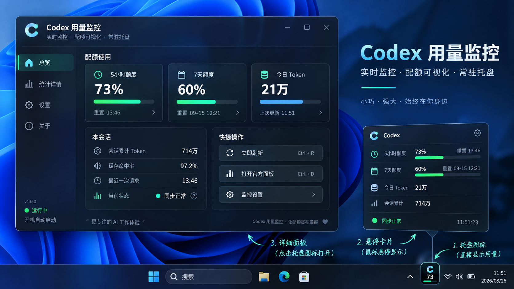
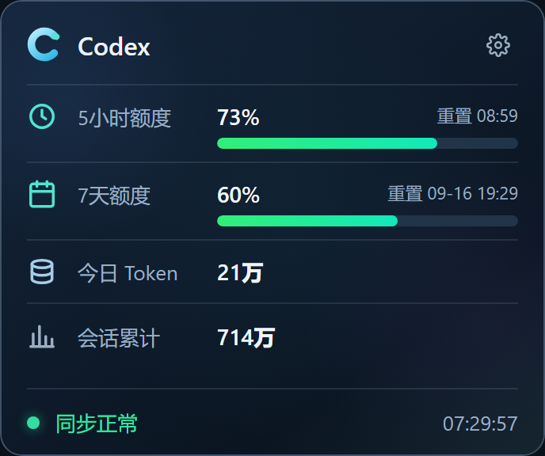
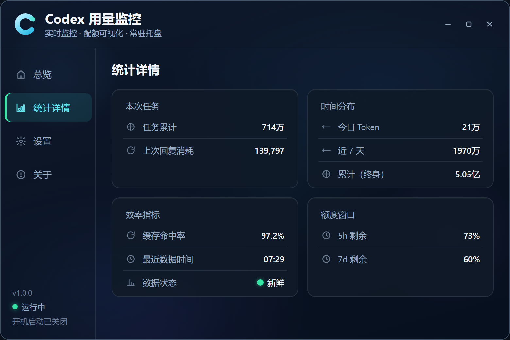
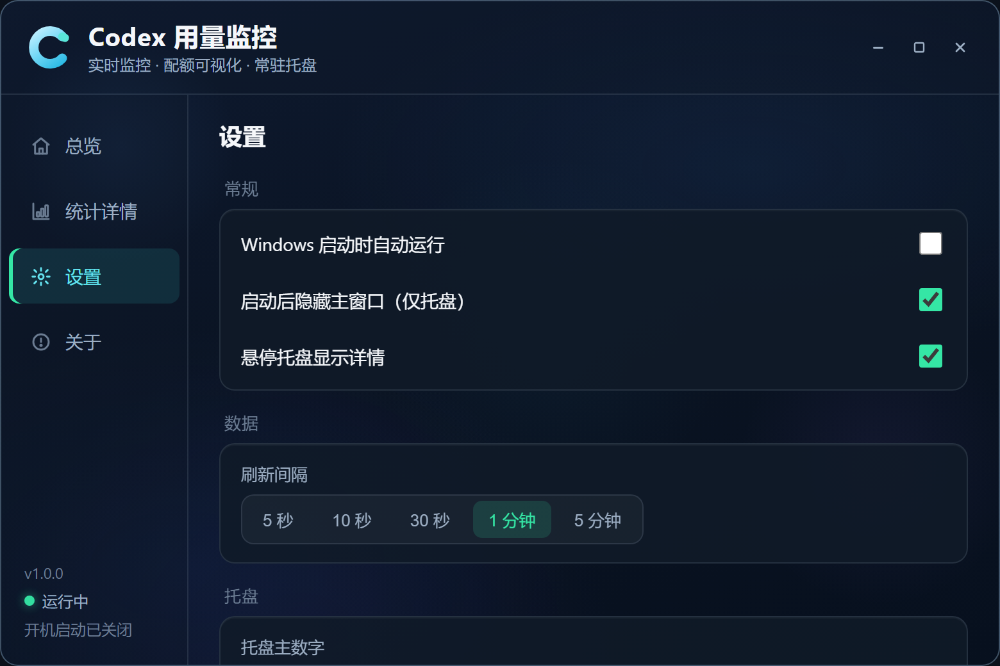

# Codex Usage Monitor · Codex 用量监控

一款 Windows 常驻托盘工具，让你随时查看 Codex 剩余额度、重置时间和本地 Token 用量。

基于 **Go + Wails + Vue 3** 构建，使用 Windows 原生托盘与 WebView2 渲染界面。适合在使用 Codex 时放在通知区，快速了解额度消耗情况。

> 本项目为第三方工具，与 OpenAI 无隶属关系。

*界面截图使用预览数据，不代表真实账号额度。*

## 功能

- **托盘数字额度**：直接显示剩余百分比，可切换 5 小时或 7 天额度作为主指标，并可显示长期额度条。
- **悬停速览**：鼠标移到托盘图标上即可查看用量卡片，点击打开详细面板。
- **额度与重置时间**：结合本地记录和在线快照展示额度，按记录时间选择较新的数据。
- **Token 统计**：查看今日、近 7 天、累计 Token、本任务、上次对话和今日缓存命中率。
- **自动与手动刷新**：支持 5 秒、10 秒、30 秒、1 分钟、5 分钟，默认 1 分钟。
- **低额度提醒**：5 小时和 7 天额度可分别设置 10%、20%、30% 提醒阈值，也可关闭。
- **桌面集成**：支持开机启动、启动时隐藏到托盘、单实例运行和键盘快捷键。
- **代理支持**：读取 Windows 当前用户的手动系统代理，也支持代理环境变量。

查看悬停卡片、统计与设置截图

## 下载与使用

1. 在本仓库的 **Releases** 页面下载 `codex-monitor.exe`。
2. 确保 Windows 已安装 Microsoft Edge WebView2 Runtime。
3. 先使用 Codex 登录并进行一次对话，让本机生成会话记录。在线额度读取需要本地 `auth.json` 中存在 ChatGPT OAuth 登录凭证。
4. 双击运行程序。默认启动后隐藏到通知区，可在任务栏的隐藏图标区域找到它。

发布程序为便携式 EXE，无需安装本项目的 Go、Node.js 或 Wails 开发环境。配置保存在用户目录中，不随 EXE 存放。

| 操作 | 行为 |
| --- | --- |
| 悬停托盘图标 | 显示用量卡片 |
| 左键点击托盘图标 | 显示或隐藏详细面板 |
| 右键点击托盘图标 | 打开刷新、面板、设置、开机启动和退出菜单 |
| 关闭窗口 / `Escape` | 隐藏到托盘 |
| `Ctrl + R` | 刷新数据 |
| `Ctrl + D` | 打开官方用量页面 |
| 托盘菜单 → 退出 | 完全退出程序 |

键盘快捷键在应用窗口获得焦点时使用。再次启动程序会打开已有实例的面板。

## 常见问题

**启动后看不到窗口？**  
默认仅显示托盘图标，请展开任务栏隐藏图标区域并点击程序图标。

**显示无数据或 Token 为 0？**  
检查 Codex 是否已经生成会话记录，以及 `CODEX_HOME` 是否指向正确目录。部分统计需要记录中包含对应字段。

**在线刷新失败？**  
检查本地 Codex 登录状态、网络与代理设置。当前实现需要 `auth.json` 中的 OAuth 凭证；重新登录 Codex 后可手动刷新。

**为什么与官方页面的数字不完全一致？**  
本地与在线快照的采集时间可能不同，整数显示采用向下取整，Token 统计也仅覆盖本地记录。请结合更新时间与同步状态判断。

**如何更新？**  
从托盘菜单退出程序后，用新版 EXE 替换旧文件。配置保留在用户目录；目前不提供自动更新。

反馈问题时，请附上系统版本、复现步骤和界面错误提示，并移除认证凭证与会话中的私人内容。

